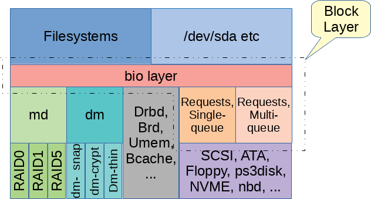

# Linux Architecture Notes

## Rendering Stack

## Networking Stack

- [NAPI (New API)](https://docs.kernel.org/networking/napi.html): poll packets
  from the NIC in bulk so that it does not interrupt the CPU too much
- [Netlink](https://www.kernel.org/doc/html/next/userspace-api/netlink/intro.html):
  we use this to communicate with the kernel and configure the network stack

## Storage Stack

In order to not issue many commands to the storage device, the kernel manages
a page cache. This is essentually a copy-on-write cache which gets checked
before accessing a page. If data gets written to a page, the cache gets dirty,
and it can be flushed to the device.

To manage read and writes to the storage device, the Linux kernel uses the `bio`
structure which connects the filesystem to a particular storage device.

- [Storage Performance Development Kit](https://spdk.io/): fast and modern API
  to interact with NVMe devices

## Unique Kernel Contributors per Subsystem

|Subsystem             |Percentage  |Info |
|----------------------|------------|-----------------------------------------------------------------------------------------------------------------------------------------|
|Drivers (General)     | ~55% - 60%	| This includes GPU (about 30% of all drivers), Network, Multimedia, and Sound. It’s the "hardware enablement" tax. If it doesn't have a driver, the silicon is dead.|
|Networking (net/)     | 8% - 10%	| Massive corporate focus from Meta, Google, and Mellanox/Nvidia. This is the core of the cloud.|
|Filesystems (fs/)     | ~7% - 8%	| This is the "Data Integrity" tier. Recent spikes come from Bcachefs (Kent Overstreet) and cloud-scale optimizations for NVMe.|
|Core Kernel (kernel/, mm/)| ~5%	| The "Priesthood." This is the smallest group of developers, but they have the highest gatekeeping standards. It includes scheduling and memory management.|
|eBPF (kernel/bpf)     | ~4%	    | This is the fastest-growing niche. eBPF is becoming the universal "glue" for observability and networking, drawing in engineers from Distributed Systems. |
|Arch Specific (arch/) | ~10%	    | Mostly ARM64 and RISC-V churn. RISC-V is currently seeing a "gold rush" of first-time contributors. |

Source: gemini.

## Build systems

- [Linux Kernel Module](https://github.com/San7o/linux-kernel-module): raw
  kernel development quickstart
- [LKDE](https://github.com/San7o/lkde-tool): light kernel dev framework
- [tmp105-driver](https://github.com/San7o/tmp105-driver/): buildroot based
  driver
- yocto: TODO
