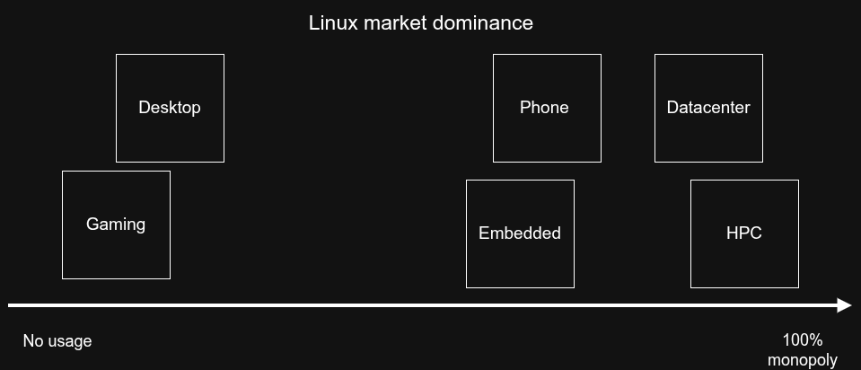
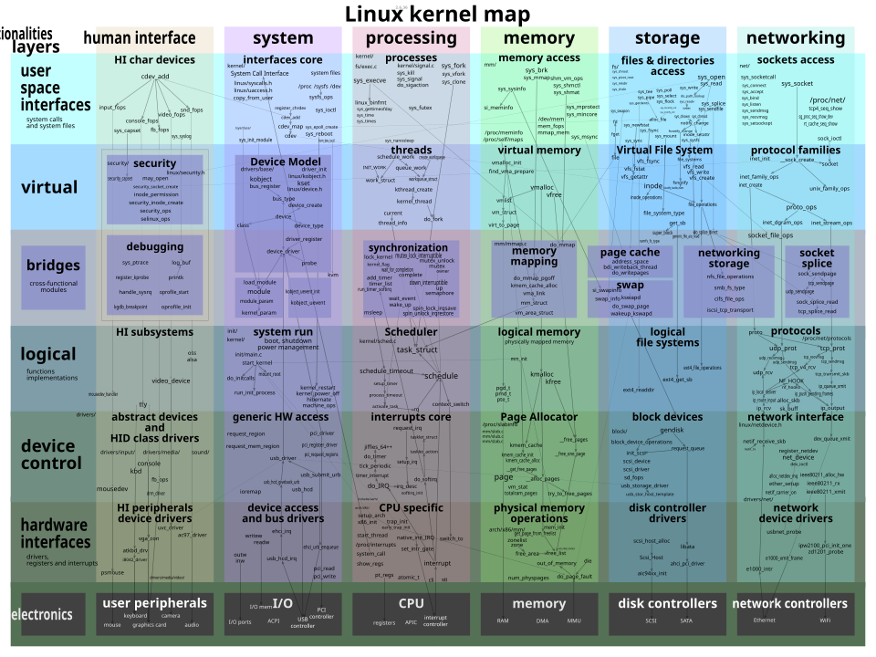
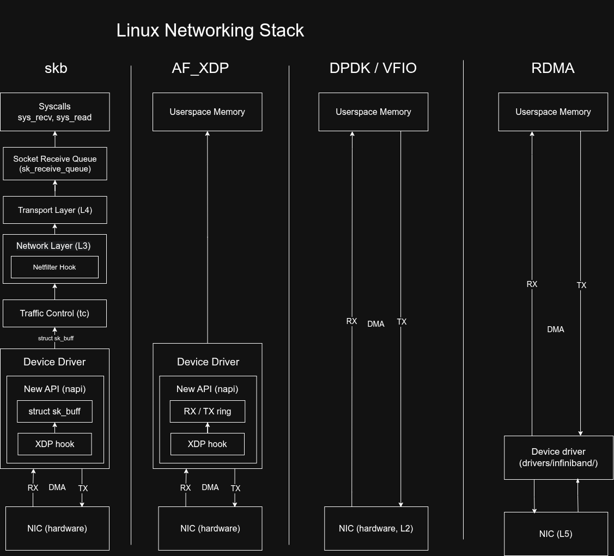
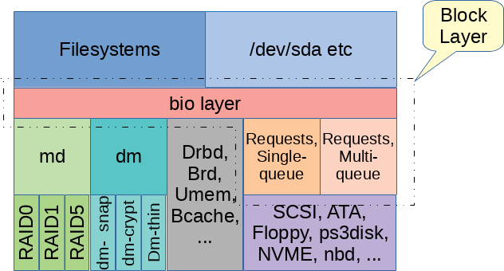
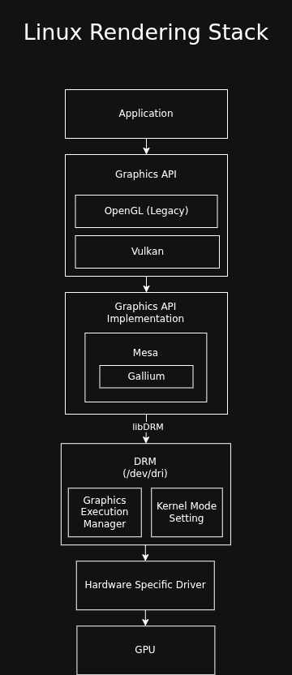
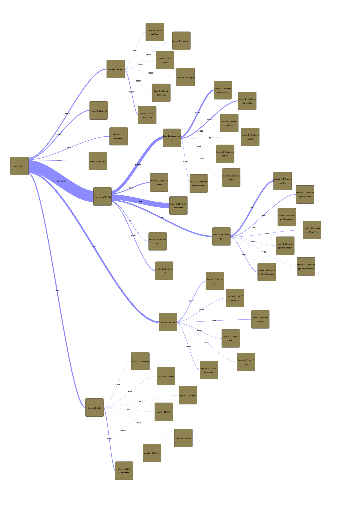

Linux Architecture Diagrams
===========================

Bird's eye view of the Linux kernel:

Networking Stack
----------------

Concepts:

* NAPI_ (New API): poll packets from the NIC in bulk so that it does not
  interrupt the CPU too much

* Netlink_: we use this to communicate with the kernel and configure the network
  stack

* `TUN`: L3 virtual tunnel

* `TAP`: L2 virtual tap

* `veth`: virtual Ethernet devices. veth devices are always created in
  interconnected pairs so that packets  transmitted on one device in the pair
  are immediately received on the other device. A  particularly  interesting use
  case is to place one end of a veth pair in one network namespace and the other
  end in another network namespace, thus allowing communi‐ cation between
  network namespaces. See `veth(4)`.

Future developments:

- `netkit`_: eBPF-programmable network device

.. _NAPI: https://docs.kernel.org/networking/napi.html
.. _Netlink: https://www.kernel.org/doc/html/next/userspace-api/netlink/intro.html)
.. _netkit: https://lwn.net/Articles/949960/

Storage Stack
-------------

To manage read and writes to the storage device, the Linux kernel uses the `bio`
structure which connects the filesystem to a particular storage device.

In order to not issue many commands to the storage device, the `bio` manages a
page cache. This is a copy-on-write cache which gets checked before accessing a
page. If data gets written to a page, the cache gets dirty, and it can be
flushed to the device.

- `Storage Performance Development Kit`_: fast and modern API to interact with
  NVMe devices. It depends on SPDK for network path.

.. _Storage Performance Development Kit: https://spdk.io/

Rendering Stack
---------------

TODO: I still need to do a deep down here. Here is my understanding after
working with graphics in userspace.

HPC
---

HPC Linux is very different than Embedded Linux or Desktop Linux or even
Datacenter Linux. The main problem is performance, we want to bypass the kernel,
DMA everything and not use locks. We have special hardware for HPC (e.g.
infiniband) and standards to solve highly-specific HPC problems.

* `OpenBMC <https://www.openbmc.org/>`_: implementation of baseboard management
  controllers (BMC) firmware stack, which controls a CPU in the context of a
  dataceter / HPC cluster.

* `OpenHPC <https://openhpc.community/>`_: a Linux distribution and set of tools
  for HPC.

* `OpenUCX <https://openucx.readthedocs.io/en/master/index.html>`_: set of
  abstractions and primitives for high performance communication, using hardware
  offload like RDMA, GPUs etc.

* `Open Programmable Infrastructure (OPI) <https://opiproject.org/>`_:
  standardization effort for DPU/IPU-based systems (network, storage and
  security offload).

Networking:

* `Ultra Ethernet Consortium (UEC) Specification
  1.0 <https://ultraethernet.org/wp-content/uploads/sites/20/2025/10/UE-Specification-1.0.1.pdf>`_:
  open standard to compete with NVIDIA's infiniband with a solution based on
  ethernet.

* `libfabric <https://ofiwg.github.io/libfabric/>`_: userspace library used by
  MPI, PyTorch and similar frameworks that manage HPC networking and compute.

Storage:

* `Distributed Asynchronous Object Storage (DAOS) <https://daos.io/>`_

* `NVMe 2.0 <https://nvmexpress.org/specifications/>`_: modern specification to
  access non-volatile memory, supporting NVMe-over-fabric (NVME-of) for HPC.

Sankey diagram
--------------

Lines of code per area:

