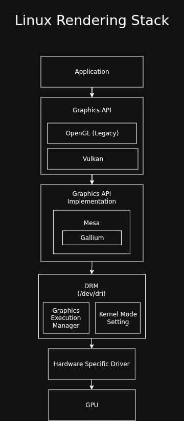

# Linux Architecture Notes

## Rendering Stack

## Unique Kernel Contributors per Subsystem

|Subsystem             |Percentage  |Info |
|----------------------|------------|-----------------------------------------------------------------------------------------------------------------------------------------|
|Drivers (General)     | ~55% - 60%	| This includes GPU, Network, Multimedia, and Sound. It’s the "hardware enablement" tax. If it doesn't have a driver, the silicon is dead.|
|Networking (net/)     | 8% - 10%	| Massive corporate focus from Meta, Google, and Mellanox/Nvidia. This is the core of the cloud.|
|Filesystems (fs/)     | ~7% - 8%	| This is the "Data Integrity" tier. Recent spikes come from Bcachefs (Kent Overstreet) and cloud-scale optimizations for NVMe.|
|Core Kernel (kernel/, mm/)| ~5%	| The "Priesthood." This is the smallest group of developers, but they have the highest gatekeeping standards. It includes scheduling and memory management.|
|eBPF (kernel/bpf)     | ~4%	    | This is the fastest-growing niche. eBPF is becoming the universal "glue" for observability and networking, drawing in engineers from Distributed Systems. |
|Arch Specific (arch/) | ~10%	    | Mostly ARM64 and RISC-V churn. RISC-V is currently seeing a "gold rush" of first-time contributors. |

Source: gemini.
